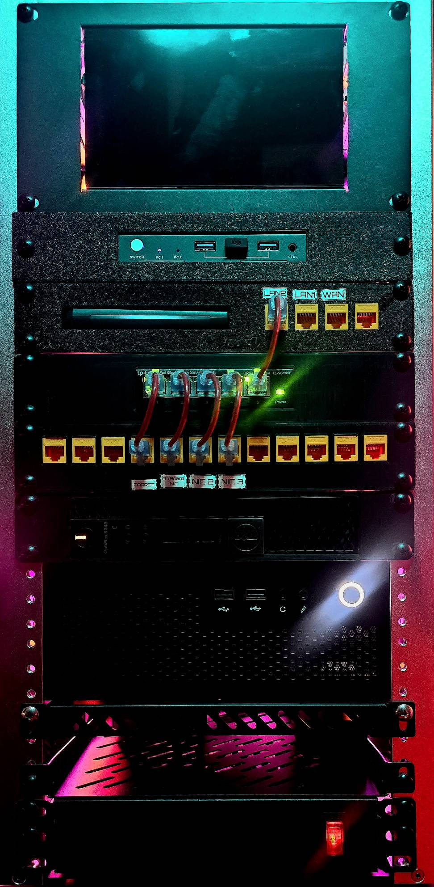
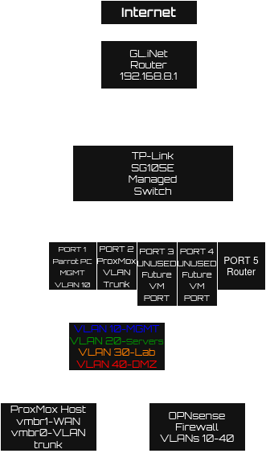

🧪 Home Lab: VLAN Segmentation with Proxmox + OPNsense

This project builds a segmented network lab using **VLANs, a managed switch, and a virtualized firewall (OPNsense)** inside a **10-inch home lab rack**.  

It simulates a **small enterprise network architecture** and demonstrates practical skills in:

- Network segmentation  
- VLAN trunking  
- Virtualized firewalls  
- Proxmox networking  
- Troubleshooting real network issues  

---

## 📸 Physical Lab Setup

This lab is built inside a **10-inch rack-mounted home lab environment**.

Hardware includes:

- Mini PC running **Proxmox VE**  
- Managed switch for **VLAN segmentation**  
- Dedicated firewall VM using **OPNsense**  
- Admin workstation running **Parrot OS**  




---

## 🧰 Hardware & Tools

| Component | Purpose |
|----------|---------|
| GL.iNet A1300 | Internet Router |
| TP-Link SG105E | Managed VLAN Switch |
| Proxmox VE | Hypervisor |
| OPNsense | Virtual Firewall |
| Parrot OS PC | Admin / security workstation |

---

## 🎯 Project Goals

Key objectives of the lab:

- Implement **VLAN-based network segmentation**  
- Route all traffic through **OPNsense firewall**  
- Create a **virtualized networking environment**  
- Practice **real troubleshooting scenarios**  
- Build a **resume-ready networking project**

---

## 🧠 Network Architecture



---

## 🌐 VLAN Design

| VLAN | Name | Purpose |
|-----|------|--------|
| 10 | Management | Admin devices |
| 20 | Servers | Future services |
| 30 | Lab | Testing environment |
| 40 | DMZ | Public services |

---

## 🔌 Physical Wiring

| Device | Connected To | Purpose |
|------|-------------|--------|
| GL.iNet Router | Switch Port 5 | Internet uplink |
| Proxmox NIC | Switch Port 2 | VLAN trunk |
| Parrot PC | Switch Port 1 | Management access |
| Extra NIC | Switch Port 4 | Future lab devices |

---

## ⚙️ Proxmox Network Configuration

| Bridge | Interface | Purpose |
|------|------|------|
| vmbr0 | enp3s0 | VLAN trunk to switch |
| vmbr1 | enp1s0f1 | WAN connection |

`vmbr0` was configured as a **VLAN-aware bridge** to pass tagged VLAN traffic to the OPNsense VM.

---

## 🔥 OPNsense Firewall Configuration

| Interface | Bridge |
|------|------|
| WAN | vmbr1 |
| LAN (trunk) | vmbr0 |

---

## 🧩 VLAN Interfaces (OPNsense)

Parent interface: `vtnet0`

| VLAN | Interface |
|------|------|
| VLAN 10 | vtnet0.10 |
| VLAN 20 | vtnet0.20 |
| VLAN 30 | vtnet0.30 |
| VLAN 40 | vtnet0.40 |

---

## 📡 DHCP Configuration

DHCP enabled on **VLAN 10 (Management Network)**

- **Range:** 192.168.10.2 – 192.168.10.100  
- **Gateway:** 192.168.10.1  

---

## 🧪 Troubleshooting Scenarios

### NIC Link Issues

NIC interfaces were detected but **no link lights appeared on the switch**.

```bash
sudo ip link set enp1s0f1 up
sudo ip link set enp1s0f0 up
OPNsense WAN Detection Failure

Auto-detection failed during installation.

Solution: manually assign vtnet1 → WAN.

GUI Access Failure

OPNsense GUI could not be reached.

Cause: Subnet mismatch (192.168.1.x vs 192.168.8.x)

Temporary fix: 192.168.8.190/24

Permanent fix: Move LAN to VLAN 10 (192.168.10.1/24)

DHCP Conflicts

Parrot OS received multiple IP addresses.

Cause: DHCP servers from GL.iNet and OPNsense overlapping

Fix:

sudo ip addr del 192.168.8.xxx/24 dev enp2s0
✅ Final Network State
Device	IP Address
GL.iNet Router	192.168.8.1
Switch	192.168.8.2
Proxmox Host	192.168.8.10
OPNsense Firewall	192.168.10.1
Parrot PC	192.168.10.x
🧠 Skills Demonstrated

VLAN segmentation

Managed switch configuration

Proxmox networking

Virtualized firewalls

DHCP configuration

Network troubleshooting

Layer 2 / Layer 3 networking

🚀 Next Steps

Route internet traffic fully through OPNsense

Implement VLAN firewall policies

Deploy internal services on VLAN 20

Create DMZ for public services

Integrate WiFi VLANs
