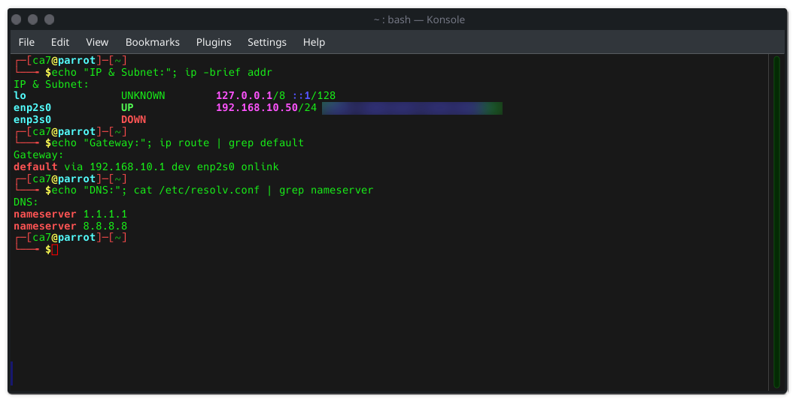
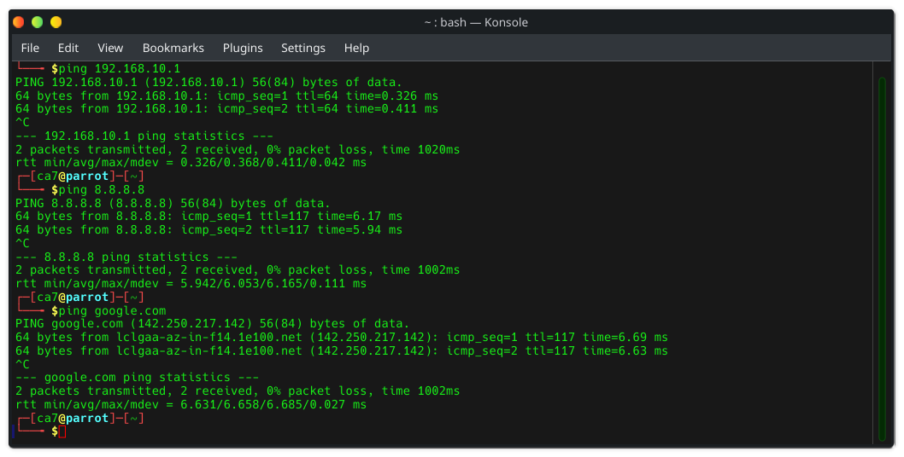

# 🖥 Home Lab: OPNsense VLAN10 Network Setup

## Overview
Hands-on home lab for VLAN-based network segmentation using **OPNsense** on a **Proxmox VM**.

- **Goal:** Deploy a VLAN10 subnet with DHCP, gateway, and DNS for static and dynamic clients.  
- **Key Troubleshooting:** Devices could ping IPs but **DNS resolution failed**. The Parrot PC was using `192.168.8.1` as DNS — unreachable from VLAN10. Solution: set static DNS to `1.1.1.1 / 8.8.8.8` and configure OPNsense LAN to forward DNS for DHCP clients.

---

## Lab Components
| Component | Role |
|-----------|------|
| OPNsense VM | Firewall / DHCP / DNS |
| VLAN10 Subnet | 192.168.10.0/24 |
| DHCP Server | Kea DHCP |
| Static Test PC | Parrot Linux |
| WAN Gateway | GL.iNet Router |
| DNS | OPNsense LAN or public (1.1.1.1 / 8.8.8.8) |

---

## Configuration Steps

### 1️⃣ VLAN10 Subnet Setup
- Subnet: `192.168.10.0/24`  
- DHCP Pool: `192.168.10.100–192.168.10.200`  
- LAN Gateway: `192.168.10.1`  
- DNS: OPNsense LAN forwards to `1.1.1.1 / 8.8.8.8`  


---

### 2️⃣ Static PC Configuration
- IP: `192.168.10.50`  
- Subnet Mask: `255.255.255.0`  
- Gateway: `192.168.10.1`  
- DNS: `1.1.1.1 / 8.8.8.8` (manual)  



---

### 3️⃣ Troubleshooting & Resolution
- **Issue:** Devices could ping IPs but not resolve domains (`ping google.com`)  
- **Cause:** Parrot PC pointed to `192.168.8.1` instead of reachable DNS  
- **Solution:**  
  1. Update static DNS on Parrot PC → `1.1.1.1 / 8.8.8.8`  
  2. Configure OPNsense LAN to forward DNS queries for DHCP clients  
  3. Verify internet connectivity and DNS resolution  



---

### 4️⃣ Testing Connectivity
```bash
ping 192.168.10.1    # LAN gateway
ping 8.8.8.8         # Internet IP
ping google.com      # DNS resolution

🛠 Lessons Learned / Quick Wins
	•	Always verify DNS is reachable for each VLAN
	•	When ping works but domain resolution fails → check DHCP and VLAN DNS settings